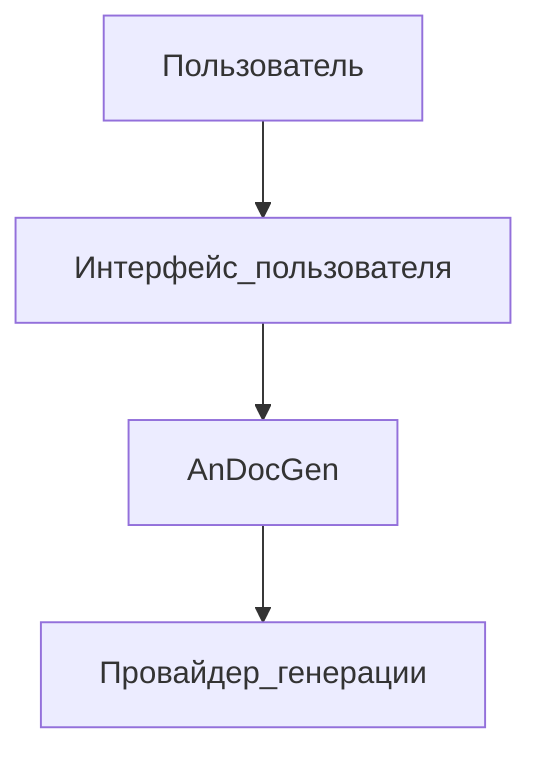
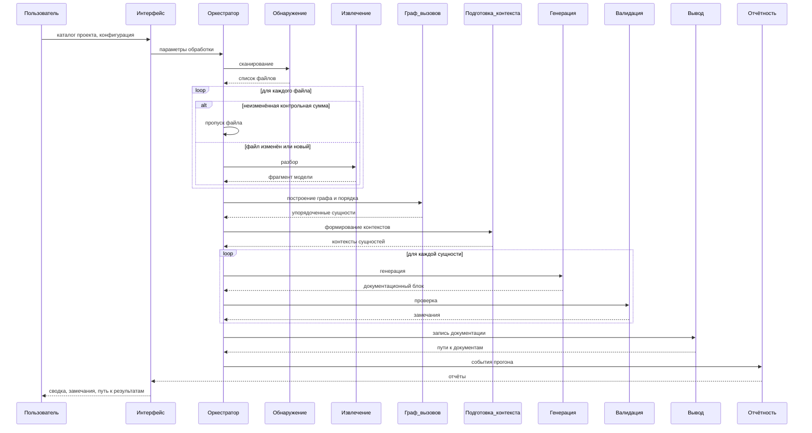

# Архитектура системы генерации технической документации

Документ описывает архитектуру системы AnDocGen — автоматической генерации технической документации из исходного кода. Система построена как модульный однонаправленный конвейер: каждый модуль выполняет одну задачу, принимает данные на входе и передаёт результат следующему модулю. Оркестратор координирует последовательность этапов от обнаружения исходных файлов до формирования итоговой документации и отчётов прогона.

## 1. Общее описание архитектуры

AnDocGen — **модульная система** с однонаправленным конвейером обработки. Модули связаны потоками данных и не обращаются напрямую к внутренней реализации друг друга. Такой подход позволяет независимо разрабатывать и заменять отдельные модули, не затрагивая соседние этапы, а также отслеживать данные на каждом шаге обработки.

Архитектура включает следующие уровни:

- **интерфейс пользователя** — точка входа, через которую задаются каталог проекта и параметры обработки;
- **оркестратор** — координирует запуск модулей в нужной последовательности;
- **конвейер обработки** — последовательность модулей от обнаружения файлов до записи документации;
- **внешний провайдер генерации** — источник формирования текста документации (шаблонный, локальный или внешний сервис).

Каждый модуль конвейера решает одну задачу. Реализация отдельного модуля может быть заменена без изменения остальных. Точки расширения:

- **Обнаружение** — новые правила отбора файлов, фильтры по языку или каталогу.
- **Извлечение** — парсер для другого языка программирования.
- **Граф вызовов** — альтернативные стратегии построения связей между сущностями.
- **Подготовка контекста** — дополнительные источники контекста (описание проекта, метаданные сборки).
- **Генерация** — другой провайдер формирования текста, в том числе языковая модель.
- **Валидация** — новые группы проверок, сравнение с эталоном, углублённый семантический анализ.
- **Вывод** — другой формат документации (HTML, PDF, wiki).
- **Отчётность** — дополнительные каналы и уровни детализации отчётов.

## 2. Структурная схема системы

### 2.1. Контекст системы

На верхнем уровне система взаимодействует с пользователем, внутренним конвейером обработки и внешним провайдером генерации текста.

**Контекст системы.** Пользователь инициирует обработку через интерфейс системы. AnDocGen выполняет конвейер преобразований и при необходимости обращается к внешнему провайдеру генерации для формирования текста документации.

### 2.2. Модули конвейера

Внутренняя структура системы состоит из модулей, связанных однонаправленными потоками данных. Оркестратор охватывает весь конвейер и управляет передачей данных между модулями. Циклических зависимостей между модулями нет.

```mermaid
flowchart LR
    Interface[Интерфейс_пользователя]
    Orchestrator[Оркестратор]
    Discovery[Обнаружение]
    Extraction[Извлечение]
    CallGraph[Граф_вызовов]
    ContextPrep[Подготовка_контекста]
    Generation[Генерация]
    Validation[Валидация]
    OutputMod[Вывод]
    Reporting[Отчётность]

    Interface --> Orchestrator
    Orchestrator --> Discovery
    Discovery --> Extraction
    Extraction --> CallGraph
    CallGraph --> ContextPrep
    ContextPrep --> Generation
    Generation --> Validation
    Validation --> OutputMod
    OutputMod --> Reporting
```

**Структурная схема модулей.** Интерфейс пользователя передаёт параметры оркестратору. Оркестратор последовательно запускает модули конвейера: обнаружение → извлечение → граф вызовов → подготовка контекста → генерация → валидация → вывод → отчётность.

## 3. Основные компоненты системы

| Модуль | Назначение | Вход | Выход |
|--------|------------|------|-------|
| **Интерфейс пользователя** | Запуск обработки, приём параметров | Каталог проекта, конфигурация | Результат прогона |
| **Оркестратор** | Координация этапов, инкрементальный пропуск файлов | Конфигурация, каталог проекта | Команды модулям, итоговый статус |
| **Обнаружение** | Отбор исходных файлов по правилам | Каталог, правила отбора | Список файлов, контрольные суммы |
| **Извлечение** | Синтаксический анализ, построение модели | Список файлов | Фрагменты модели проекта |
| **Граф вызовов** | Связи между сущностями, порядок обработки | Модель проекта | Упорядоченный список сущностей |
| **Подготовка контекста** | Сбор данных для генерации по сущности | Модель проекта, параметры | Набор контекстов сущностей |
| **Генерация** | Формирование текста документации | Контексты сущностей | Документационные блоки |
| **Валидация** | Проверка согласованности с кодом | Блоки, сигнатуры сущностей | Проверенные блоки, замечания |
| **Вывод** | Сохранение документации и кэша | Блоки, параметры вывода | Файлы документации |
| **Отчётность** | Формирование отчётов прогона | События и статистика прогона | Сводка, детальный отчёт, трассировка |

### 3.1. Интерфейс пользователя

Принимает от пользователя путь к каталогу проекта и параметры обработки. Передаёт их оркестратору и по завершении возвращает результат: сводку прогона, список обработанных файлов, замечания и путь к сгенерированной документации.

### 3.2. Оркестратор

Связывает модули конвейера в единый рабочий процесс. Определяет порядок вызова модулей, передаёт данные между этапами, управляет инкрементальным пропуском неизменённых файлов и собирает события прогона для модуля отчётности.

### 3.3. Обнаружение

Обходит каталог проекта и формирует список исходных файлов, подлежащих обработке. Учитывает расширения файлов, исключаемые каталоги и шаблоны исключения путей. Вычисляет контрольные суммы содержимого файлов для инкрементального режима.

### 3.4. Извлечение

Выполняет синтаксический анализ исходного кода каждого отобранного файла. Извлекает программные сущности — модули, классы, функции, методы — вместе с сигнатурами, комментариями и связями внутри файла. При ошибке разбора отдельного файла фиксирует ошибку и продолжает обработку остальных.

### 3.5. Граф вызовов

На основе модели проекта строит связи между программными сущностями: вызовы функций и методов, зависимости между модулями. Определяет порядок обработки сущностей с учётом зависимостей — сначала документируются сущности без исходящих зависимостей, затем их вызывающие.

### 3.6. Подготовка контекста

Для каждой программной сущности собирает сведения, необходимые для генерации документации: сигнатуру, исходный код, импорты, связи с другими сущностями, фрагмент описания проекта. В инкрементальном режиме может включать ранее сгенерированную документацию по изменённой сущности.

### 3.7. Генерация

Формирует текст документации для каждой сущности на основе её контекста. Делегирует формирование текста **провайдеру генерации** — шаблонному, локальному или внешнему. При недоступности провайдера генерация прерывается с сообщением об ошибке. Результат передаётся в валидацию в виде документационного блока.

### 3.8. Валидация

Получает документационный блок сущности и данные структурной модели (сигнатура, тип сущности). Состав проверок настраивается через конфигурацию. Результат — список замечаний, включаемых в отчёт прогона. При невозможности сформировать документационный блок сущность не передаётся в валидацию — фиксируется ошибка генерации.

**Группы проверок:**

| Группа | Что проверяется |
|--------|-----------------|
| **Полнота описания сущности** | Документация охватывает все значимые элементы контракта сущности из исходного кода: назначение, входные аргументы, результат работы, при необходимости — исключения и граничные случаи |
| **Согласованность с исходным кодом** | Описанные аргументы, типы и возвращаемые значения соответствуют фактической сигнатуре; в тексте нет ссылок на несуществующие элементы программы |
| **Структурная целостность ответа** | Ответ содержит все обязательные разделы заданного формата; для неприменимых разделов явно указано отсутствие информации |
| **Согласованность представлений** | Структурированное представление документации и итоговый текст для вывода не противоречат друг другу и отражают одну и ту же информацию о сущности |
| **Качество текста** | Предупреждения при неполном, пустом или явно недостаточном описании назначения сущности |
| **Сравнение с эталоном** | Опциональное сопоставление сгенерированного текста с существующей документацией в исходниках или эталонным описанием; результаты включаются в детальный отчёт |

### 3.9. Вывод

Сохраняет итоговую документацию в выходной каталог. Формирует сводный документ проекта и документы модулей с сохранением структуры исходного проекта. Обновляет кэш контрольных сумм для инкрементального режима.

### 3.10. Отчётность

Собирает события прогона от оркестратора и модулей конвейера. Формирует три уровня отчётности: краткую сводку, детальный отчёт и файл трассировки. Различает типы событий: ошибки разбора, ошибки генерации, замечания проверок.

## 4. Потоки данных между компонентами

Передача данных между компонентами однонаправленна: каждый модуль получает данные на входе, преобразует их и передаёт результат следующему участнику. Оркестратор управляет этими передачами, не изменяя сами данные конвейера.

Пользователь передаёт в интерфейс системы путь к каталогу проекта и файл конфигурации. Интерфейс преобразует их в параметры обработки и передаёт оркестратору, который инициирует работу конвейера.

Оркестратор направляет в модуль обнаружения каталог проекта и правила отбора файлов. Обнаружение возвращает список путей к отобранным исходникам и контрольные суммы их содержимого. Этот список поступает в модуль извлечения, который для каждого файла формирует структурное описание модулей и программных сущностей — фрагменты модели проекта.

После разбора всех файлов фрагменты объединяются в единую модель проекта и передаются в модуль графа вызовов. Граф вызовов дополняет модель связями между сущностями и определяет порядок их дальнейшей обработки. Модель проекта вместе с установленным порядком сущностей поступает в модуль подготовки контекста.

Подготовка контекста для каждой сущности формирует набор сведений, необходимых для генерации документации: сигнатуру, фрагменты исходного кода, связи с другими сущностями, описание проекта. Контекст одной сущности передаётся в модуль генерации, который возвращает документационный блок — текст описания по данной сущности.

Документационный блок вместе с данными структурной модели поступает в модуль валидации. Валидация возвращает проверенный блок и список замечаний, если они обнаружены. Проверенные блоки передаются в модуль вывода, который записывает файлы документации в выходной каталог и обновляет кэш контрольных сумм для инкрементального режима.

Параллельно основному конвейеру оркестратор передаёт в модуль отчётности сведения о ходе прогона: ошибки, предупреждения, статистику обработанных и пропущенных файлов. Отчётность формирует сводку, детальный отчёт и файл трассировки, которые через интерфейс системы возвращаются пользователю.

## 5. Последовательность обработки данных

Обработка данных выполняется в следующей последовательности:

1. Пользователь указывает каталог проекта и файл конфигурации.
2. Интерфейс передаёт параметры обработки оркестратору.
3. Модуль обнаружения формирует список исходных файлов и их контрольные суммы.
4. Для каждого файла: при включённом инкрементальном режиме и неизменной контрольной сумме файл пропускается; иначе выполняется извлечение.
5. При ошибке разбора отдельного файла ошибка фиксируется в отчёте, обработка остальных файлов продолжается.
6. Фрагменты модели проекта объединяются в единую модель.
7. Модуль графа вызовов строит связи между сущностями и определяет порядок их обработки.
8. Модуль подготовки контекста формирует контекст для каждой сущности.
9. Для каждой сущности в установленном порядке: генерация документационного блока, затем валидация.
10. Модуль вывода записывает документацию в выходной каталог и обновляет кэш контрольных сумм.
11. Модуль отчётности формирует сводку, детальный отчёт и файл трассировки.
12. Интерфейс возвращает пользователю результат прогона.

**Диаграмма последовательности обработки.** Показан полный цикл от запроса пользователя до получения отчётов. Ветвление в цикле обработки файлов отражает инкрементальный пропуск неизменённых файлов. Граф вызовов выполняется после разбора всех файлов, до формирования контекстов.

## 6. Взаимодействие с пользователем

Пользователь инициирует обработку через интерфейс системы. На вход передаются:

- каталог проекта с исходным кодом;
- файл конфигурации с параметрами обработки (правила отбора файлов, язык документации, провайдер генерации, каталог вывода и др.).

По завершении прогона пользователь получает:

- краткую сводку: число обработанных и пропущенных файлов, количество ошибок и предупреждений, время выполнения;
- путь к выходному каталогу с документацией;
- детальный отчёт с указанием проблемных файлов, классов и функций;
- файл трассировки с поэтапной историей выполнения.

Сообщения об ошибках содержат указание проблемного файла, класса или функции. Учётные данные для внешних сервисов задаются через конфигурацию и переменные окружения, а не хранятся в анализируемом проекте.

## 7. Конфигурация системы

Параметры системы группируются по этапам конвейера. Каждый блок конфигурации управляет соответствующим модулем.

| Блок | Модуль | Что настраивается |
|------|--------|-------------------|
| `project` | — | название проекта, общее описание, путь к описанию проекта |
| `discovery` | Обнаружение | расширения файлов, исключаемые каталоги, шаблоны исключения путей |
| `extraction` | Извлечение | язык исходного кода |
| `call_graph` | Граф вызовов | способ построения графа вызовов |
| `context` | Подготовка контекста | включение тела исходного кода, импортов, графа вызовов; лимит фрагмента описания проекта; ограничение объёма контекста |
| `generation` | Генерация | провайдер; язык документации; инкрементальный режим; число параллельных запросов; число повторных попыток; параметры провайдеров (адрес сервиса, модель, переменная окружения для ключа) |
| `validation` | Валидация | включение и отключение групп проверок: полнота описания, согласованность с кодом, целостность ответа, согласованность представлений, качество текста, сравнение с эталоном |
| `output` | Вывод | каталог результатов, формат, путь к кэшу инкрементального режима |
| `reporting` | Отчётность | каталог отчётов, имена файлов сводки, детального отчёта и трассировки; уровень детализации записи в трассировку |

## 8. Инкрементальная обработка

Единица инкрементального обновления — **исходный файл**.

1. После успешной обработки файла модуль вывода сохраняет контрольную сумму его содержимого.
2. По умолчанию сумма хранится в подкаталоге кэша выходного каталога; путь переопределяется параметром `output.cache_path`.
3. При следующем запуске с включённым инкрементальным режимом файлы с неизменённой контрольной суммой пропускаются.
4. Для каждого изменённого файла выполняются: пересборка фрагмента модели проекта, обновление графа вызовов, полная перегенерация всех сущностей файла, обновление соответствующих выходных документаций и сводного документа проекта.

## 9. Отчётность прогона

Модуль отчётности формирует три уровня отчётности:

| Уровень | Канал | Содержание |
|---------|-------|------------|
| **Сводка** | стандартный поток вывода и файл в каталоге отчётов | число обработанных и пропущенных файлов, количество ошибок и предупреждений, путь к выходному каталогу, время выполнения |
| **Детальный отчёт** | файл в каталоге отчётов | ошибки и предупреждения с указанием файла, класса или функции; замечания валидации; цикломатическая сложность сущностей при превышении порога |
| **Трассировка** | файл в каталоге отчётов | полная история этапов конвейера, время выполнения по модулям, обращения к провайдеру генерации |

Типы событий различаются: ошибки разбора, ошибки генерации, замечания проверок.

## 10. Форматы вывода

Документация сохраняется в текстовом виде с разметкой заголовков, списков и ссылок. Навигация обеспечивается заголовками секций внутри файла модуля и относительными ссылками между файлами модулей и сводным документом проекта.

Структура выходных файлов:

- **сводный документ проекта** — в корне выходного каталога; содержит название проекта, общее назначение и перечень модулей со ссылками на их документацию;
- **документы модулей** — отдельный файл на каждый модуль; структура выходных путей повторяет структуру исходного проекта; каждый документ содержит описание назначения модуля, классов и функций верхнего уровня.
