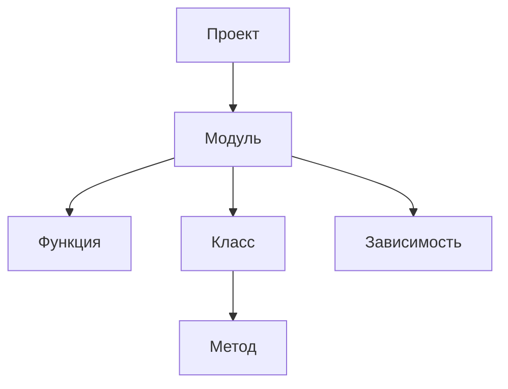
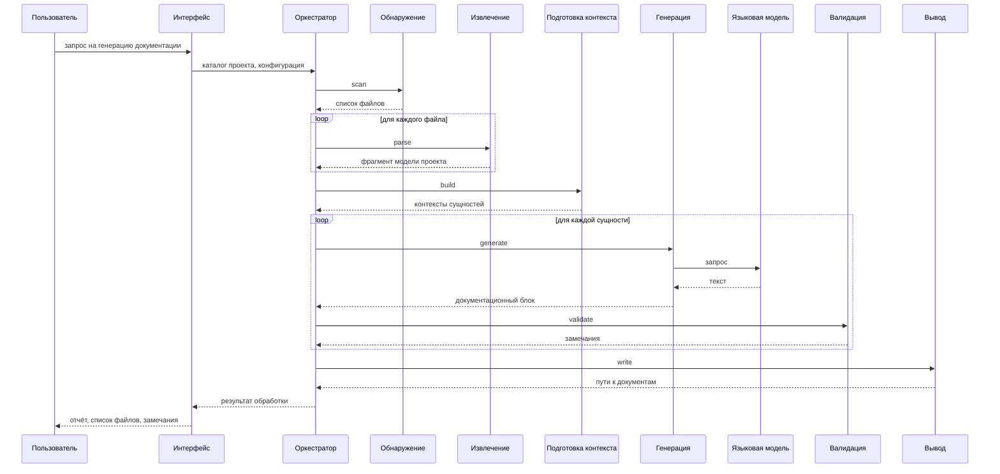

# Архитектура системы генерации технической документации

Документ описывает модульную архитектуру AnDocGen: состав системы, потоки данных между модулями, структуры данных и взаимодействие с пользователем. Описание не привязано к конкретному языку программирования или технологическому стеку.

## 1. Модульная архитектура

AnDocGen построена как **модульная система**: каждый модуль выполняет одну задачу конвейера, принимает данные на входе и передаёт результат следующему модулю. Модули связаны однонаправленными потоками данных и не обращаются напрямую к внутренней реализации друг друга.

Такой подход позволяет независимо разработывать и тестировать каждый модуль, заменить реализацию одного модуля без изменения остальных, трассировать данные на каждом этапе обработки.

Также при такой подход позволяет предусмотреть точки расширения. Добавить новую реализацию модуля без изменения соседних:

- **Обнаружение** — новые правила отбора файлов, фильтры по языку или каталогу.
- **Извлечение** — парсер для другого языка программирования.
- **Подготовка контекста** — дополнительные источники контекста (система контроля версий, описание проекта, задачи).
- **Генерация** — другой способ или провайдер формирования текста, в том числе языковая модель.
- **Валидация** — новые правила проверки, углублённый семантический анализ.
- **Вывод** — другой формат документации (HTML, PDF, wiki).

## 2. Диаграмма взаимодействия модулей

Каждый модуль читает данные из входных каналов, выполняет преобразование и записывает результат в выходные каналы. Передача данных между модулями однонаправленна; циклических зависимостей нет.

Сеть процессов Кана передачи данных между модулями системы:

```mermaid
flowchart LR
    Discovery[Модуль обнаружения]
    Extraction[Модуль извлечения]
    ContextPrep[Модуль подготовки контекста]
    Generation[Модуль генерации]
    Validation[Модуль валидации]
    OutputMod[Модуль вывода]

    Discovery -->|"список файлов"| Extraction
    Extraction -->|"модель проекта"| ContextPrep
    ContextPrep -->|"контексты сущностей"| Generation
    Generation -->|"документационные блоки"| Validation
    Validation -->|"проверенные блоки, замечания"| OutputMod
```

## 3. Модули системы

| Модуль | Назначение | Вход | Выход |
|--------|------------|------|-------|
| **Обнаружение** | Находит в каталоге проекта файлы, подлежащие обработке, с учётом правил отбора и исключения | Каталог проекта, параметры конфигурации | Список путей к исходным файлам |
| **Извлечение** | Выполняет синтаксический анализ исходного кода и строит структурную модель проекта | Список файлов, содержимое файлов, язык исходного кода | Модель проекта |
| **Подготовка контекста** | Для каждой программной сущности собирает данные, необходимые для генерации документации | Модель проекта, параметры конфигурации | Набор контекстов сущностей |
| **Генерация** | Формирует текст документации на основе контекста сущности | Контексты сущностей, параметры генерации | Документационные блоки |
| **Валидация** | Проверяет соответствие сгенерированного текста структурной модели | Документационные блоки, сигнатуры сущностей, правила проверки | Проверенные блоки, список замечаний |
| **Вывод** | Сохраняет итоговую документацию и формирует отчёт о прогоне | Проверенные блоки, параметры вывода | Файлы документации, отчёт об обработке |

Модуль **оркестрации** (не показан на схеме) связывает перечисленные модули в единый конвейер и передаёт им данные в нужной последовательности.

## 4. Структуры данных

### 4.1. Модель проекта

- **Проект**
  - путь к корневому каталогу;
  - список модулей.
- **Модуль**
  - путь к исходному файлу;
  - документирующий комментарий модуля;
  - список зависимостей (импорты, включения);
  - список функций;
  - список классов.
- **Функция**
  - имя, параметры, тип возвращаемого значения;
  - документирующий комментарий;
  - список вызываемых функций;
  - позиция в исходном файле.
- **Класс**
  - имя, базовые типы;
  - список полей;
  - список методов;
  - документирующий комментарий;
  - позиция в исходном файле.

### 4.2. Контекст сущности

- тип сущности (модуль, класс, функция);
- имя сущности;
- сигнатура;
- существующая документация из исходного кода;
- фрагмент исходного кода;
- импорты модуля;
- вызываемые функции;
- имя проекта.

### 4.3. Документационный блок

- тип и имя сущности;
- путь к модулю;
- сгенерированный текст документации.

### 4.4. Результат обработки

- список обработанных и пропущенных файлов;
- выходные файлы документации;
- замечания валидации (предупреждения и ошибки);
- время выполнения и сводная статистика.

## 5. Взаимодействие с пользователем

Пользователь инициирует обработку через интерфейс системы (CLI, GUI или API), указывая каталог проекта и конфигурацию. По завершении система возвращает отчёт: список файлов, замечания, путь к результатам.

## 6. Конфигурация

Параметры системы группируются по этапам конвейера. Каждый блок конфигурации управляет соответствующим модулем:

| Блок | Модуль | Основные параметры |
|------|--------|-------------------|
| discovery | Обнаружение | расширения файлов, исключаемые каталоги |
| extraction | Извлечение | язык исходного кода |
| context | Подготовка контекста | состав включаемой информации |
| generation | Генерация | способ генерации, язык документации, инкрементальный режим |
| validation | Валидация | включаемые виды проверок |
| output | Вывод | каталог результатов, формат документации |

## 7. Инкрементальная обработка

При повторном запуске система может обрабатывать только изменённые файлы. Модуль вывода сохраняет контрольную сумму содержимого каждого обработанного файла. При следующем запуске модули обнаружения и извлечения пропускают файлы с неизменённой суммой.
