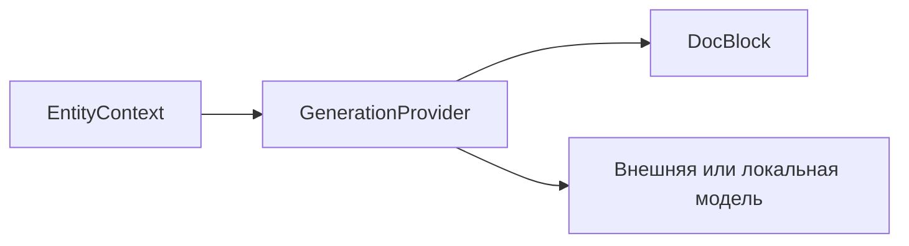
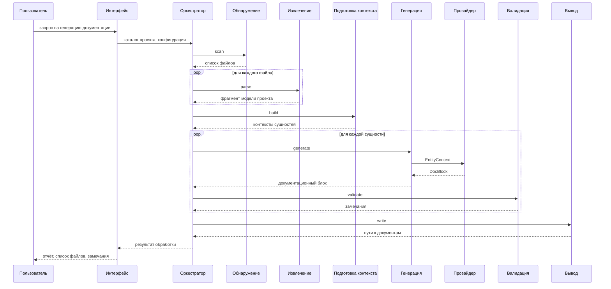

# Архитектура системы генерации технической документации

Документ описывает модульную архитектуру AnDocGen: состав системы, потоки данных между модулями, интерфейс провайдеров генерации, конфигурацию и взаимодействие с пользователем. Описание не привязано к конкретному языку программирования или технологическому стеку. Интерфейс конкретной реализации (CLI, GUI и т.д.) описывается отдельно.

## 1. Модульная архитектура

AnDocGen построена как **модульная система**: каждый модуль выполняет одну задачу конвейера, принимает данные на входе и передаёт результат следующему модулю. Модули связаны однонаправленными потоками данных и не обращаются напрямую к внутренней реализации друг друга.

Такой подход позволяет независимо разработывать и тестировать каждый модуль, заменить реализацию одного модуля без изменения остальных, трассировать данные на каждом этапе обработки.

Такой подход также позволяет предусмотреть точки расширения — добавить новую реализацию модуля без изменения соседних:

- **Обнаружение** — новые правила отбора файлов, фильтры по языку или каталогу.
- **Извлечение** — парсер для другого языка программирования.
- **Подготовка контекста** — дополнительные источники контекста (система контроля версий, описание проекта).
- **Генерация** — другой провайдер формирования текста, в том числе языковая модель.
- **Валидация** — новые rule-based правила, метрики BLEU/ROUGE, углублённый семантический анализ.
- **Вывод** — другой формат документации (HTML, PDF, wiki).

## 2. Диаграмма взаимодействия модулей

Каждый модуль читает данные из входных каналов, выполняет преобразование и записывает результат в выходные каналы. Передача данных между модулями однонаправленна; циклических зависимостей нет.

Диаграмма потоков данных конвейера:

## 3. Модули системы

| Модуль | Назначение | Вход | Выход |
|--------|------------|------|-------|
| **Обнаружение** | Находит в каталоге проекта файлы, подлежащие обработке, с учётом правил отбора и исключения | Каталог проекта, параметры конфигурации | Список путей к исходным файлам |
| **Извлечение** | Выполняет синтаксический анализ исходного кода и строит структурную модель проекта | Список файлов, содержимое файлов, язык исходного кода | Модель проекта |
| **Подготовка контекста** | Для каждой программной сущности собирает данные, необходимые для генерации документации | Модель проекта, параметры конфигурации | Набор контекстов сущностей |
| **Генерация** | Формирует текст документации на основе контекста сущности через провайдер генерации | Контексты сущностей, параметры генерации | Документационные блоки |
| **Валидация** | Проверяет соответствие сгенерированного текста структурной модели | Документационные блоки, сигнатуры сущностей, правила проверки | Проверенные блоки, список замечаний |
| **Вывод** | Сохраняет итоговую документацию и формирует отчёты прогона | Проверенные блоки, параметры вывода | Файлы документации, отчёты |

Модуль **оркестрации** (не показан на схеме) связывает перечисленные модули в единый конвейер и передаёт им данные в нужной последовательности.

### 3.1. Модуль валидации

**Текущая реализация:** rule-based сверка документационного блока со структурной моделью (наличие параметров, соответствие сигнатуре, return type, обнаружение phantom names). Виды проверок включаются через блок `validation` конфигурации.

**Целевое развитие:** добавление метрик **BLEU** и **ROUGE** для сравнения сгенерированного текста с эталонной документацией или исходными docstrings; результаты метрик включаются в детальный отчёт прогона.

## 4. Интерфейс провайдера генерации

Модуль генерации делегирует формирование текста **провайдеру генерации** — реализации единого интерфейса. Один вызов провайдера соответствует одной программной сущности.

**Вход провайдера:** структура контекста сущности (описана отдельно).

**Выход провайдера:** документационный блок для одной сущности (описан отдельно).

**Реализации:**

- Шаблонная генерация без обращения к внешним системам; проверка конфигурации и конвейера 
- Локальная языковая модель через Ollama API 
- OpenAI-compatible API (внешние публичные сервисы при указании ключа)

При ошибке провайдера (недоступность модели, таймаут, некорректный ответ) генерация прерывается с сообщением об ошибке. Формат ответа языковой модели и сборка промпта описаны отдельно.

## 5. Взаимодействие с пользователем

Пользователь инициирует обработку через интерфейс системы, указывая каталог проекта и конфигурацию. По завершении система возвращает отчёт: список файлов, замечания, путь к результатам.

## 6. Конфигурация

Параметры системы группируются по этапам конвейера. Каждый блок конфигурации управляет соответствующим модулем.

| Блок | Модуль | Что настраивается                                                                                                                      |
|------|--------|----------------------------------------------------------------------------------------------------------------------------------------|
| `discovery` | Обнаружение | расширения файлов, исключаемые каталоги, шаблоны исключения путей                                                                      |
| `extraction` | Извлечение | язык исходного кода                                                                                                                    |
| `context` | Подготовка контекста | включение тела исходного кода, импортов, графа вызовов; лимит фрагмента README; политика truncation при превышении лимита контекста    |
| `generation` | Генерация | провайдер; язык документации ISO 639-1; инкрементальный режим; параметры провайдеров (URL, модель, переменная окружения для API-ключа) |
| `validation` | Валидация | конфигурация проверок: параметры метрик, предупреждение при пустом описании                                                            |
| `output` | Вывод | каталог результатов, формат, путь к кэшу инкрементального режима                                                                       |
| `reporting` | Отчётность | пути к detail-отчёту и log-файлу (по умолчанию — подкаталог в директории с выводом)                                                    |

## 7. Инкрементальная обработка

Единица инкрементального обновления — **исходный файл**.

1. После успешной обработки файла модуль вывода сохраняет SHA-256 контрольную сумму его содержимого.
2. По умолчанию сумма хранится в `{output}/.cache/`; путь переопределяется параметром `output.cache_path`.
3. При следующем запуске с `generation.incremental: true` файлы с неизменённой контрольной суммой пропускаются.
4. Для каждого изменённого файла: пересборка фрагмента модели проекта, обновление графа вызовов, полная перегенерация всех сущностей файла, обновление соответствующих выходных документаций и сводного документа проекта.

## 8. Отчётность прогона

Система формирует три уровня отчётности:

| Уровень | Канал                                              | Содержание                                                                                                                                        |
|---------|----------------------------------------------------|---------------------------------------------------------------------------------------------------------------------------------------------------|
| **Summary** | стандартный поток вывода и файл в `{output}/logs/` | число обработанных и пропущенных файлов, количество ошибок и предупреждений, путь к output, время выполнения                                      |
| **Detail** | файл в `{output}/logs/`                            | ошибки и предупреждения с указанием названия файла/класса/функции; замечания валидации; цикломатическую сложность сущностей при превышении порога |
| **Trace** | log-файл в `{output}/logs/`                        | полная трассировка этапов конвейера, время выполнения по модулям, вызовы провайдера                                                               |

Типы событий различаются: ошибки разбора, ошибки провайдера, замечания проверок.

## 9. Форматы вывода

**Markdown** — основной формат. Навигация: заголовки секций внутри файла модуля, относительные ссылки между файлами модулей и сводным документом проекта.

**HTML** — опиция модуля вывода. Навигация межстраничная: отдельная страница на модуль, индекс проекта со ссылками на модули.

Структура выходных файлов (сводный документ + повторение структуры проекта).
