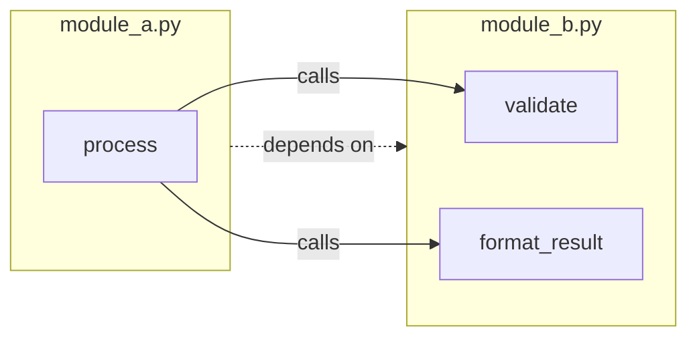
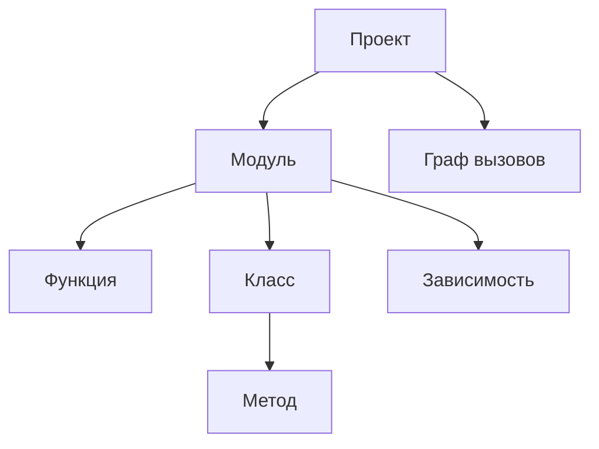
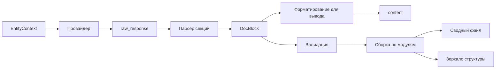

# Метод подготовки входных и выходных данных

Документ описывает структуры данных системы, метод извлечения информации из исходного кода, сборку промпта для языковой модели, цепочку записи документации, примеры и краткий метод отбора проектов для апробации.

## 1. Метод извлечения информации из исходного кода

### 1.1. Общий подход

Алгоритм извлечения информации из исходного кода одинаков для всех поддерживаемых языков:

1. Прочитать текстовое содержимое исходного файла.
2. Выполнить синтаксический разбор и построить дерево (или граф) структуры программы.
3. Обойти дерево и извлечь программные сущности: модуль, зависимости, классы, функции, сигнатуры, документирующие комментарии, вызовы.
4. Для каждой функции и метода вычислить **цикломатическую сложность**; значение сохраняется для отчётов производительности.
5. Построить **граф вызовов** по всему проекту: связи «вызывающая сущность → вызываемая сущность» с учётом импортов и разрешения имён между модулями.
6. Построить **модель проекта** — единое структурированное представление всех модулей и графа зависимостей.

### 1.2. Средства синтаксического разбора

| Язык | Рекомендуемые средства |
|------|------------------------|
| Python 3.10+ | стандартный модуль `ast` |
| Java | **JavaParser** или **javalang** |
| Универсальные | ANTLR, Tree-sitter — для расширения на другие языки |

Выбор конкретного парсера Java определяется на этапе реализации; оба варианта должны извлекать поля, перечисленные далее.

### 1.3. Извлекаемые элементы

| Элемент | Извлекаемые поля                                                                                                                                                                    |
|---------|-------------------------------------------------------------------------------------------------------------------------------------------------------------------------------------|
| Модуль | документирующий комментарий, зависимости, функции и классы верхнего уровня, мета-информация о пакете                                                                                |
| Зависимость (import) | имя модуля, импортируемые имена, уровень вложенности                                                                                                                                |
| Класс | имя, базовые типы, модификаторы, аннотации, документирующий комментарий, поля, методы, позиция в файле                                                                             |
| Функция / метод | имя, параметры, аннотации типов, тип возвращаемого значения, модификаторы, документирующий комментарий, исходящие рёбра графа вызовов, позиция в файле, полное тело |
| Вызов | вызывающая сущность, вызываемое имя (локальное или квалифицированное), целевой модуль при разрешении                                                                                |
| Аннотации типов | строковое представление типов параметров и возвращаемого значения                                                                                                                   |
| Граф вызовов | узлы (функции и методы), рёбра (вызовы), зависимости между модулями                                                                                                                 |

### 1.4. Обработка docstrings и комментариев

Документирующие блоки (docstring, Javadoc, XML-комментарии и аналоги) извлекаются из соответствующих узлов дерева разбора.

### 1.5. Граф вызовов

При извлечении строится **граф вызовов** проекта.

**Узлы** — функции и методы с указанием модуля (и класса для методов). **Рёбра** — факт вызова: вызывающая сущность → вызываемая сущность. Для каждого вызова в теле функции фиксируется локальное имя; затем выполняется **разрешение имён** с учётом импортов, алиасов и относительных путей, чтобы связать вызов с конкретным узлом в другом модуле, если это возможно статически.

На основе графа вызовов формируются:

- **зависимости между модулями** — какие модули вызывают сущности из каких модулей;
- **порядок генерации документации** — сначала документируются «листовые» функции без исходящих зависимостей, затем их вызывающие (топологическая сортировка по графу);
- **контекст для генерации** — при документировании функции в промпт модели включается уже сгенерированная (или существующая) документация вызываемых ею функций и методов.



### 1.6. Граничные случаи

Ключевые языковые конструкции и их поддержка:

**Python**

| Конструкция                                                     | Статус                                                                                   |
|-----------------------------------------------------------------|------------------------------------------------------------------------------------------|
| Декораторы (`@decorator`)                                       | частичная поддержа — декоратор извлекается как имя; семантика не анализируется           |
| `@property`, `@staticmethod`, `@classmethod`                    | поддерживается — метод классифицируется по типу                                          |
| `__init__.py`, re-exports                                       | частичная поддержа — импорты извлекаются; re-export может не разрешаться в               |
| Динамические вызовы (`getattr`, `eval`, вызов через переменную) | не поддерживается — ребро вызова не создаётся                                            |
| `*args`, `**kwargs`                                             | частичная поддержа — параметры извлекаются; описание в документации может быть обобщённым |
| Синтаксическая ошибка в файле                                   | поддерживается — файл пропускается, ошибка фиксируется в отчёте                  |

**Java**

| Конструкция                       | Статус                                                                                                |
|-----------------------------------|-------------------------------------------------------------------------------------------------------|
| Annotations (`@Override`, custom) | поддерживается — строковое представление на сущности                                                  |
| Generic типы                      | частичная поддержа — типы параметров из исходного текста; стираение времени выполнения не учитывается |
| Вызовы рефлексии                  | не поддерживается                                                                                     |
| Inner / nested classes            | поддерживается — класс привязан к внешнему; методы извлекаются                                        |
| Синтаксическая ошибка в файле     | поддерживается — файл пропускается, ошибка в отчёте                                                   |

Неразрешённые вызовы в графе отражаются в контексте как локальное имя без ссылки на документацию зависимости.

## 2. Структуры данных

Структуры данных, передаваемые между модулями системы.

### 2.1. Модель проекта

- **Проект**
  - путь к корневому каталогу;
  - список модулей;
  - граф вызовов.
- **Модуль**
  - путь к исходному файлу;
  - документирующий комментарий модуля;
  - мета-информаци о пакете;
  - список зависимостей (импорты, включения);
  - список функций;
  - список классов.
- **Зависимость**
  - импортируемый модуль, имена, уровень вложенности.
- **Функция**
  - имя, параметры, тип возвращаемого значения;
  - документирующий комментарий;
  - цикломатическая сложность;
  - полный текст тела;
  - исходящие рёбра графа вызовов;
  - позиция в исходном файле.
- **Класс**
  - имя, базовые типы, модификаторы, аннотации;
  - список полей;
  - список методов;
  - документирующий комментарий;
  - позиция в исходном файле.
- **Параметр**
  - имя, тип, значение по умолчанию.
- **Граф вызовов**
  - узлы (функции и методы), рёбра (вызовы), зависимости между модулями.



Поле вызовов у функции может хранить исходящие рёбра в компактном виде; полный граф собирается на уровне проекта отдельно.

### 2.2. JSON-схема модели проекта

```json
{
  "project_path": "/path/to/project",
  "modules": [
    {
      "path": "calculator/operations.py",
      "docstring": "Arithmetic operations module.",
      "imports": [
        {"module": "typing", "names": ["Optional"], "level": 0}
      ],
      "functions": [
        {
          "name": "add",
          "parameters": [
            {"name": "a", "type": "float", "default": null},
            {"name": "b", "type": "float", "default": null}
          ],
          "returns": "float",
          "docstring": null,
          "complexity": 1,
          "source_body": "return a + b",
          "calls": [],
          "line_start": 5,
          "line_end": 7
        }
      ],
      "classes": []
    }
  ],
  "call_graph": {
    "nodes": [
      {"id": "calculator/operations.py::add", "module": "calculator/operations.py", "name": "add", "kind": "function"}
    ],
    "edges": []
  }
}
```

### 2.3. Контекст сущности (EntityContext)

Данные, собираемые для одной программной сущности перед генерацией документации. В промпт сущности включается **только информация, связанная с этой сущностью**; метаданные сборки проекта (pyproject.toml, pom.xml) используются только при генерации сводного файла проекта.

| Поле | Обязательность | Описание |
|------|----------------|----------|
| `entity_type` | да | `module` / `class` / `function` / `method` |
| `entity_name` | да | имя сущности |
| `module_path` | да | путь к исходному файлу |
| `signature` | да | строковая сигнатура |
| `source_docstring` | нет | docstring / Javadoc из исходника |
| `source_body` | да | полное тело функции/метода/класса |
| `imports` | да | импорты модуля |
| `called_entities_docs` | нет | документация вызываемых сущностей (из call graph, в топологическом порядке) |
| `base_class_docs` | нет | документация базовых классов (для методов) |
| `project_name` | да | из конфигурации |
| `readme_excerpt` | нет | фрагмент README (лимит символов из config) |
| `previous_output_doc` | нет | ранее сгенерированный Markdown-блок сущности (при повторной генерации, FR-2.6) |
| `output_language` | да | код ISO 639-1 (`ru` / `en`) |
| `complexity` | для function/method | цикломатическая сложность |

### 2.4. Сборка промпта

Один запрос к провайдеру = одна сущность. Промпт состоит из **system** и **user** сообщений.

**System message** (шаблон, English):

```
You are a technical documentation generator.
Write section body text in {output_language}.
Respond with Markdown using exactly these English section headers (in this order), with no extra sections:

For function/method:
## Summary
## Parameters
## Returns
## Raises
## Edge cases
## Side effects
## Examples
## See also

For class:
## Summary
## Fields
## Inheritance
## Methods overview

For module:
## Summary
## Exports

Use "N/A" in a section when it does not apply. Do not invent parameters, types, or behavior not present in the source code.
```

**User message** — секции в порядке убывания приоритета при truncation:

| Секция | Содержание                                               |
|--------|----------------------------------------------------------|
| Entity | тип, имя, сигнатура, цикломатическая сложность (если есть) |
| Source | docstring из исходника, полное тело                      |
| Previous output | ранее сгенерированная документация (если есть)           |
| Dependencies | import модуля                                            |
| Called entities | Markdown-документация вызываемых функций/методов         |
| Base classes | документация базовых классов                             |
| Project | название и описание проекта                              |

**Truncation policy:** при превышении лимита контекста провайдера секции усекаются в обратном порядке. Секции Entity и Source не усекаются.

**Не включается** в промпт сущности: содержимое pyproject.toml, pom.xml и аналогов (используется только для сводного файла проекта).

#### Пример EntityContext (function с вызовами)

```json
{
  "entity_type": "function",
  "entity_name": "process",
  "module_path": "app/service.py",
  "signature": "def process(data: dict) -> Result",
  "source_docstring": null,
  "source_body": "validated = validate(data)\nreturn format_result(validated)",
  "imports": [{"module": "app.utils", "names": ["validate", "format_result"]}],
  "called_entities_docs": [
    {"name": "validate", "content": "### validate(data: dict) -> bool\n\n..."},
    {"name": "format_result", "content": "### format_result(data: dict) -> Result\n\n..."}
  ],
  "base_class_docs": [],
  "project_name": "my_app",
  "readme_excerpt": null,
  "previous_output_doc": null,
  "output_language": "ru",
  "complexity": 2
}
```

Полный пример system message и user message для сущности `process` — в `docs/examples/prompt_process_function.md`.

### 2.5. Формат ответа языковой модели

Провайдер возвращает **Markdown-текст** с фиксированными **английскими заголовками секций**; текст внутри секций — на языке `output_language`.

**Function / method** (обязательный порядок):

```
## Summary
## Parameters
## Returns
## Raises
## Edge cases
## Side effects
## Examples
## See also
```

Формат `## Parameters`: список `- \`name\` (\`type\`) — description`.

Формат `## Returns`: `- \`type\` — description`.

Секции `## Raises`, `## Edge cases`, `## Side effects`, `## Examples`, `## See also`: список или строка `N/A`.

**Class:**

```
## Summary
## Fields
## Inheritance
## Methods overview
```

**Module:**

```
## Summary
## Exports
```

#### Парсинг ответа

Модуль генерации извлекает секции по заголовкам `##` и заполняет structured-поля DocBlock (п. 2.6). При отсутствии обязательной секции, неверном формате списка параметров или невозможности разбора ответа обработка сущности завершается **ошибкой generation** (без fallback на частичный результат).

Один успешно разобранный ответ → один **DocBlock**. Содержательные требования к документации — в requirements, раздел 5.

### 2.6. Документационный блок (DocBlock)

Единая структура результата генерации для одной сущности. Содержит идентификацию сущности, **исходный ответ модели**, **structured-поля** (после парсинга) и **текст для вывода** (после форматирования).

**Общие поля (все типы сущностей):**

| Поле | Тип | Описание |
|------|-----|----------|
| `entity_type` | string | `module` / `class` / `function` / `method` |
| `entity_name` | string | имя сущности |
| `module_path` | string | путь к исходному файлу |
| `signature` | string | строковая сигнатура (для function/method) |
| `raw_response` | string | полный текст ответа провайдера |
| `summary` | string | назначение сущности |
| `content` | string | текст для записи в выходной файл (формируется на этапе подготовки представления для вывода) |

**Function / method** — дополнительно:

| Поле | Тип | Описание |
|------|-----|----------|
| `parameters` | array | `{name, type, description, optional?, default?}` |
| `returns` | object | `{type, description}` |
| `raises` | string | текст секции или `N/A` |
| `edge_cases` | string | текст секции или `N/A` |
| `side_effects` | string | текст секции или `N/A` |
| `examples` | string | текст секции или `N/A` |
| `see_also` | string | текст секции или `N/A` |

**Class** — дополнительно: `fields` (array), `inheritance` (string), `methods_overview` (string). Поля function/method — `null` или отсутствуют.

**Module** — дополнительно: `exports` (array `{name, type?, description}`). Остальные специализированные поля — `null` или отсутствуют.

Поле `content` формируется компонентом **подготовки представления для вывода**: structured-данные DocBlock преобразуются в текст целевого формата (Markdown, HTML и др.) согласно конфигурации output и шаблону §3.3.

```json
{
  "entity_type": "function",
  "entity_name": "add",
  "module_path": "calculator.py",
  "signature": "def add(a: float, b: float) -> float",
  "raw_response": "## Summary\n\nСкладывает два числа.\n\n## Parameters\n\n- `a` (`float`) — первое слагаемое\n...",
  "summary": "Складывает два числа.",
  "parameters": [
    {"name": "a", "type": "float", "description": "первое слагаемое", "optional": false, "default": null},
    {"name": "b", "type": "float", "description": "второе слагаемое", "optional": false, "default": null}
  ],
  "returns": {"type": "float", "description": "сумма a и b"},
  "raises": "N/A",
  "edge_cases": "N/A",
  "side_effects": "N/A",
  "examples": "N/A",
  "see_also": "N/A",
  "fields": null,
  "inheritance": null,
  "methods_overview": null,
  "exports": null,
  "content": "### `add(a: float, b: float) -> float`\n\nСкладывает два числа..."
}
```

### 2.7. Результат обработки

Сводные данные прогона системы:

- список обработанных и пропущенных файлов;
- выходные файлы документации;
- замечания валидации (предупреждения и ошибки);
- время выполнения, CC сущностей, сводная статистика.

## 3. Формат выходной документации

Цепочка преобразования ответа провайдера в файлы. Содержание выходных документов определено в requirements, раздел 5.



### 3.1. Преобразование ответа

1. Провайдер возвращает текстовый ответ модели (`raw_response`).
2. Парсер секций извлекает разделы по EN-заголовкам и заполняет structured-поля DocBlock; при сбое — ошибка generation.
3. Компонент подготовки представления для вывода формирует `content` в формате, заданном конфигурацией output.
4. Модуль валидации проверяет документационный блок относительно структурной модели (группы проверок — в architecture, раздел 3.1).
5. Модуль вывода группирует DocBlock'и и записывает файлы (§3.3).

### 3.2. Merge при повторной генерации (FR-2.6)

При инкрементальном или повторном прогоне модуль вывода извлекает из существующего `.md` файла модуля блок документации соответствующей сущности и передаёт его в `EntityContext.previous_output_doc`. Провайдер получает исходный код, предыдущую документацию и формирует обновлённый DocBlock.

### 3.3. Запись в выходные файлы

1. DocBlock'и группируются по `module_path`.
2. **Сводный файл** `{output}/README.md` (или `index.md`): project_name, project_description (config + README + pyproject.toml / pom.xml), перечень модулей с относительными ссылками.
3. **Документы модулей** — зеркало структуры: `src/pkg/module.py` → `{output}/src/pkg/module.py.md`.
4. Внутри файла модуля: заголовок проекта, описание модуля, разделы «Классы» и «Функции» с DocBlock'ами сущностей.

#### Пример фрагмента сводного файла

```markdown
# my_app

Библиотека для обработки данных.

## Модули

- [app/service.py](app/service.py.md)
- [app/utils.py](app/utils.py.md)
```

## 4. Примеры (Python)

### 4.1. Исходный код

```python
"""Simple calculator module."""

def add(a: float, b: float) -> float:
    return a + b


class Calculator:
    """Performs basic arithmetic."""

    def multiply(self, x: int, y: int) -> int:
        return x * y
```

### 4.2. JSON (фрагмент модели проекта)

```json
{
  "path": "calculator.py",
  "docstring": "Simple calculator module.",
  "functions": [
    {
      "name": "add",
      "parameters": [{"name": "a", "type": "float"}, {"name": "b", "type": "float"}],
      "returns": "float",
      "complexity": 1,
      "source_body": "return a + b"
    }
  ],
  "classes": [
    {
      "name": "Calculator",
      "docstring": "Performs basic arithmetic.",
      "methods": [
        {
          "name": "multiply",
          "parameters": [{"name": "self"}, {"name": "x", "type": "int"}, {"name": "y", "type": "int"}],
          "returns": "int",
          "complexity": 1
        }
      ]
    }
  ]
}
```

### 4.3. Фрагмент графа вызовов

```json
{
  "nodes": [
    {"id": "calculator.py::add", "module": "calculator.py", "name": "add", "kind": "function"},
    {"id": "calculator.py::Calculator.multiply", "module": "calculator.py", "name": "multiply", "kind": "method", "class": "Calculator"}
  ],
  "edges": []
}
```

### 4.4. Ответ модели (raw_response, фрагмент)

```markdown
## Summary

Складывает два числа и возвращает результат.

## Parameters

- `a` (`float`) — первое слагаемое
- `b` (`float`) — второе слагаемое

## Returns

- `float` — сумма `a` и `b`

## Raises

N/A

## Edge cases

N/A

## Side effects

N/A

## Examples

N/A

## See also

N/A
```

### 4.5. DocBlock (фрагмент после парсинга)

```json
{
  "entity_type": "function",
  "entity_name": "add",
  "module_path": "calculator.py",
  "signature": "def add(a: float, b: float) -> float",
  "raw_response": "## Summary\n\nСкладывает два числа...",
  "summary": "Складывает два числа и возвращает результат.",
  "parameters": [
    {"name": "a", "type": "float", "description": "первое слагаемое"},
    {"name": "b", "type": "float", "description": "второе слагаемое"}
  ],
  "returns": {"type": "float", "description": "сумма a и b"},
  "raises": "N/A",
  "edge_cases": "N/A",
  "side_effects": "N/A",
  "examples": "N/A",
  "see_also": "N/A",
  "content": "### `add(a: float, b: float) -> float`\n\nСкладывает два числа и возвращает результат.\n\n**Параметры:**\n- `a` (`float`) — первое слагаемое\n- `b` (`float`) — второе слагаемое\n\n**Возвращаемое значение:** `float` — сумма `a` и `b`"
}
```

### 4.6. Фрагмент выходного Markdown-файла модуля

```markdown
# calculator_app

## Модуль `calculator.py`

## Функции

### `add(a: float, b: float) -> float`

Складывает два числа и возвращает результат.

**Параметры:**
- `a` (`float`) — первое слагаемое
- `b` (`float`) — второе слагаемое

**Возвращаемое значение:** `float` — сумма `a` и `b`
```

## 5. Примеры (Java)

### 5.1. Исходный код

```java
package com.example.calc;

/**
 * Simple calculator utility.
 */
public class Calculator {

    /**
     * Adds two numbers.
     */
    public static double add(double a, double b) {
        return a + b;
    }
}
```

### 5.2. JSON (фрагмент модели проекта)

```json
{
  "path": "com/example/calc/Calculator.java",
  "package": "com.example.calc",
  "docstring": "Simple calculator utility.",
  "imports": [],
  "functions": [],
  "classes": [
    {
      "name": "Calculator",
      "modifiers": ["public"],
      "docstring": null,
      "methods": [
        {
          "name": "add",
          "modifiers": ["public", "static"],
          "parameters": [
            {"name": "a", "type": "double"},
            {"name": "b", "type": "double"}
          ],
          "returns": "double",
          "docstring": "Adds two numbers.",
          "complexity": 1,
          "source_body": "return a + b;"
        }
      ]
    }
  ]
}
```

### 5.3. DocBlock (фрагмент после парсинга)

```json
{
  "entity_type": "method",
  "entity_name": "add",
  "module_path": "com/example/calc/Calculator.java",
  "signature": "public static double add(double a, double b)",
  "raw_response": "## Summary\n\nAdds two numbers...",
  "summary": "Adds two numbers and returns the sum.",
  "parameters": [
    {"name": "a", "type": "double", "description": "first operand"},
    {"name": "b", "type": "double", "description": "second operand"}
  ],
  "returns": {"type": "double", "description": "sum of a and b"},
  "raises": "N/A",
  "edge_cases": "N/A",
  "side_effects": "N/A",
  "examples": "N/A",
  "see_also": "N/A",
  "content": "### `add(double a, double b)`\n\nAdds two numbers and returns the sum.\n\n**Параметры:**\n- `a` (`double`) — first operand\n- `b` (`double`) — second operand\n\n**Возвращаемое значение:** `double` — sum of a and b"
}
```

## 6. Инкрементальная подготовка данных

При повторном запуске с `generation.incremental: true` система сравнивает SHA-256 checksum каждого исходного файла с кэшем в `{output}/.cache/`. Неизменённые файлы пропускаются; для изменённых выполняется полная пересборка модели и перегенерация всех сущностей файла. Подробности инкрементального режима описаны в architecture, раздел 7.

## 7. Метод отбора проектов для апробации

Для проверки системы используются два уровня тестовых проектов:

| Уровень | Источник | Назначение |
|---------|----------|------------|
| Контролируемые | подготовленный набор в репозитории | воспроизводимые кейсы, эталоны, граничные ситуации |
| Внешние | open-source репозитории | проверка на реальном коде |

**Критерии отбора:** поддерживаемый язык (Python / Java согласно requirements); размер 5–50 исходных файлов; наличие функций, классов, type hints / Javadoc; открытая лицензия; достаточен исходный код без обязательного запуска приложения.

**Контролируемый набор** должен включать: модуль с функциями и классами; мультимодульный проект с import-зависимостями; граничные случаи языковых конструкций.

Детальный процесс поиска внешних проектов, фиксация commit/tag и результаты прогонов — в evaluation.
