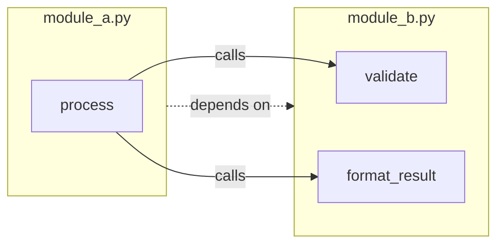
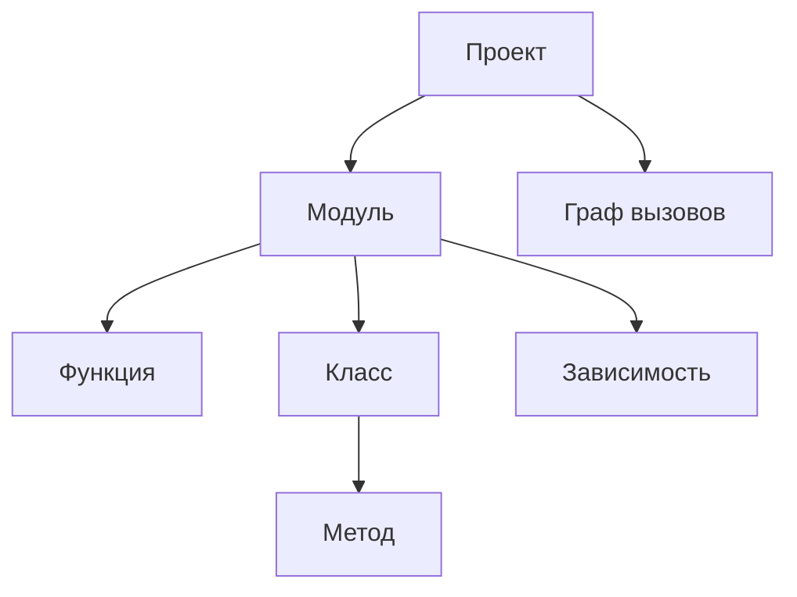
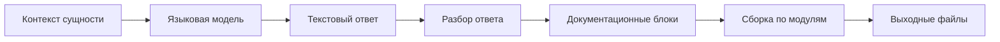

# Метод подготовки входных и выходных данных

Документ описывает структуры данных системы, метод извлечения информации из исходного кода, граф вызовов, цепочку записи документации, примеры и метод отбора проектов для апробации.

## 1. Метод извлечения информации из исходного кода

### 1.1. Общий подход

Алгоритм извлечения информации из исходного кода одинаков для всех поддерживаемых языков:

1. Прочитать текстовое содержимое исходного файла.
2. Выполнить синтаксический разбор и построить дерево (или граф) структуры программы.
3. Обойти дерево и извлечь программные сущности: модуль, зависимости, классы, функции, сигнатуры, документирующие комментарии, вызовы.
4. Построить **граф вызовов** по всему проекту: связи «вызывающая сущность → вызываемая сущность» с учётом импортов и разрешения имён между модулями.
5. Построить **модель проекта** — единое структурированное представление всех модулей и графа зависимостей.

### 1.2. Примеры средств синтаксического разбора

Для мультиязычной системы возможны универсальные инструменты: **ANTLR**, **Tree-sitter**. Или специфичные для конкретных языков: Python `ast`, **JavaParser**, **javalang**.

### 1.3. Извлекаемые элементы

| Элемент | Извлекаемые поля |
|---------|------------------|
| Модуль | документирующий комментарий, зависимости, функции и классы верхнего уровня |
| Зависимость (import) | имя модуля, импортируемые имена, уровень вложенности |
| Класс | имя, базовые типы, документирующий комментарий, поля, методы, позиция в файле |
| Функция / метод | имя, параметры, аннотации типов, тип возвращаемого значения, документирующий комментарий, исходящие рёбра графа вызовов, позиция в файле |
| Вызов | вызывающая сущность, вызываемое имя (локальное или квалифицированное), целевой модуль при разрешении |
| Аннотации типов | строковое представление типов параметров и возвращаемого значения |
| Граф вызовов | узлы (функции и методы), рёбра (вызовы), зависимости между модулями |

### 1.4. Обработка docstrings и комментариев

Документирующие блоки (docstring, Javadoc, XML-комментарии и аналоги) извлекаются из соответствующих узлов дерева разбора.

### 1.5. Граф вызовов

При извлечении строится **граф вызовов** проекта.

**Узлы** — функции и методы с указанием модуля (и класса для методов). **Рёбра** — факт вызова: вызывающая сущность → вызываемая сущность. Для каждого вызова в теле функции фиксируется локальное имя; затем выполняется **разрешение имён** с учётом импортов, алиасов и относительных путей, чтобы связать вызов с конкретным узлом в другом модуле, если это возможно статически.

На основе графа вызовов формируются:

- **зависимости между модулями** — какие модули вызывают сущности из каких модулей;
- **порядок генерации документации** — сначала документируются «листовые» функции без исходящих зависимостей, затем их вызывающие (топологическая сортировка по графу);
- **контекст для генерации** — при документировании функции в prompt включается уже сгенерированная (или существующая) документация вызываемых ею функций и методов, чтобы описание отражало реальное поведение и контракты зависимостей.



## 2. Структуры данных

Структуры данных, передаваемые между модулями системы согласно файлу с описанием архитектуры.

### 2.1. Модель проекта

- **Проект**
  - путь к корневому каталогу;
  - список модулей;
  - граф вызовов.
- **Модуль**
  - путь к исходному файлу;
  - документирующий комментарий модуля;
  - список зависимостей (импорты, включения);
  - список функций;
  - список классов.
- **Зависимость**
  - импортируемый модуль, имена, уровень вложенности.
- **Функция**
  - имя, параметры, тип возвращаемого значения;
  - документирующий комментарий;
  - исходящие рёбра графа вызовов;
  - позиция в исходном файле.
- **Класс**
  - имя, базовые типы;
  - список полей;
  - список методов;
  - документирующий комментарий;
  - позиция в исходном файле.
- **Параметр**
  - имя, тип, значение по умолчанию.
- **Граф вызовов**
  - узлы (функции и методы), рёбра (вызовы), зависимости между модулями.



Поле `calls` у функции может хранить исходящие рёбра в компактном виде; полный граф собирается на уровне проекта в `call_graph`.

### 2.2. JSON-схема модели проекта

```json
{
  "project_path": "/path/to/project",
  "modules": [
    {
      "path": "calculator/operations.py",
      "docstring": "Arithmetic operations module.",
      "imports": [
        {"module": "typing", "names": ["Optional"], "level": 0}
      ],
      "functions": [
        {
          "name": "add",
          "parameters": [
            {"name": "a", "type": "float", "default": null},
            {"name": "b", "type": "float", "default": null}
          ],
          "returns": "float",
          "docstring": null,
          "calls": [],
          "line_start": 5,
          "line_end": 7
        }
      ],
      "classes": [
        {
          "name": "Calculator",
          "bases": [],
          "docstring": "Simple calculator class.",
          "fields": [],
          "methods": [
            {
              "name": "multiply",
              "parameters": [
                {"name": "self", "type": null, "default": null},
                {"name": "x", "type": "int", "default": null},
                {"name": "y", "type": "int", "default": null}
              ],
              "returns": "int",
              "docstring": null,
              "calls": [],
              "line_start": 12,
              "line_end": 14
            }
          ],
          "line_start": 9,
          "line_end": 14
        }
      ]
    }
  ],
  "call_graph": {
    "nodes": [
      {"id": "calculator/operations.py::add", "module": "calculator/operations.py", "name": "add", "kind": "function"}
    ],
    "edges": [
      {"from": "calculator/operations.py::divide", "to": "calculator/operations.py::add"}
    ]
  }
}
```

### 2.3. Контекст сущности

Данные, собираемые для одной программной сущности перед генерацией документации:

- тип сущности (модуль, класс, функция);
- имя сущности;
- сигнатура;
- существующая документация из исходного кода;
- фрагмент исходного кода;
- импорты модуля;
- вызываемые функции и их документация (по графу вызовов);
- имя проекта.

### 2.4. Документационный блок

Результат генерации для одной сущности:

- тип и имя сущности;
- путь к модулю;
- сгенерированный текст документации (Markdown).

Пример JSON-фрагмента:

```json
{
  "entity_type": "function",
  "entity_name": "add",
  "module_path": "calculator.py",
  "content": "### `add(a: float, b: float) -> float`\n\nСкладывает два числа..."
}
```

### 2.5. Результат обработки

Сводные данные прогона системы:

- список обработанных и пропущенных файлов;
- выходные файлы документации;
- замечания валидации (предупреждения и ошибки);
- время выполнения и сводная статистика.

## 3. Формат выходной документации

Цепочка преобразования ответа языковой модели в файлы документации. Содержание выходных документов определяется согласно требованиям.



### 3.1. Формат ответа модели

Языковая модель возвращает **текст в заданном формате** — Markdown-разметку с заголовками, списками параметров и описанием возвращаемого значения. Структура секций задаётся согласно файлу с описанием архитектуры и конфигурации генерации. Один запрос соответствует одному **документационному блоку** (см. п. 2.4) для одной сущности (модуль, класс или функция).

### 3.2. Преобразование ответа в объекты

1. Согласно файлу с описанием архитектуры, модуль генерации получает текстовый ответ языковой модели для сущности.
2. Текст нормализуется (обрезка пробелов, удаление служебных префиксов при необходимости).
3. Формируется документационный блок и добавляется в **набор блоков прогона**.
4. Модуль валидации сверяет блок с сигнатурой сущности из модели проекта.

### 3.3. Запись в выходные файлы

1. Блоки группируются по `module_path`.
2. Модуль вывода собирает **документ модуля**: заголовок проекта, описание модуля, разделы «Классы» и «Функции» — согласно требованиям.
3. Формируется **сводный документ проекта** (название, назначение, перечень модулей) — согласно требованиям.
4. Результат сохраняется в текстовом формате (Markdown) в каталог, заданный в конфигурации; структура выходных каталогов повторяет структуру исходного проекта.

## 4. Примеры

Примеры на Python иллюстрируют цепочку: исходный код → модель проекта → документационный блок → выходной файл.

### 4.1. Исходный код

```python
"""Simple calculator module."""

def add(a: float, b: float) -> float:
    return a + b


class Calculator:
    """Performs basic arithmetic."""

    def multiply(self, x: int, y: int) -> int:
        return x * y
```

### 4.2. JSON (фрагмент модели проекта)

```json
{
  "path": "calculator.py",
  "docstring": "Simple calculator module.",
  "functions": [
    {
      "name": "add",
      "parameters": [
        {"name": "a", "type": "float"},
        {"name": "b", "type": "float"}
      ],
      "returns": "float"
    }
  ],
  "classes": [
    {
      "name": "Calculator",
      "docstring": "Performs basic arithmetic.",
      "methods": [
        {
          "name": "multiply",
          "parameters": [
            {"name": "self"},
            {"name": "x", "type": "int"},
            {"name": "y", "type": "int"}
          ],
          "returns": "int"
        }
      ]
    }
  ]
}
```

### 4.3. Фрагмент графа вызовов

```json
{
  "nodes": [
    {"id": "calculator.py::add", "module": "calculator.py", "name": "add", "kind": "function"},
    {"id": "calculator.py::Calculator.multiply", "module": "calculator.py", "name": "multiply", "kind": "method", "class": "Calculator"}
  ],
  "edges": []
}
```

Для функции с вызовами зависимостей ребро связывает вызывающий узел с узлом вызываемой функции; порядок генерации документации следует топологической сортировке по этому графу.

### 4.4. DocBlock (фрагмент)

```json
{
  "entity_type": "function",
  "entity_name": "add",
  "module_path": "calculator.py",
  "content": "### `add(a: float, b: float) -> float`\n\nСкладывает два числа и возвращает результат.\n\n**Параметры:**\n- `a` (`float`) — первое слагаемое\n- `b` (`float`) — второе слагаемое\n\n**Возвращаемое значение:** `float` — сумма `a` и `b`"
}
```

### 4.5. Фрагмент выходного Markdown-файла

```markdown
# calculator_app

## Модуль `calculator.py`

## Функции

### `add(a: float, b: float) -> float`

Складывает два числа и возвращает результат.

**Параметры:**
- `a` (`float`) — первое слагаемое
- `b` (`float`) — второе слагаемое

**Возвращаемое значение:** `float` — сумма `a` и `b`
```

## 5. Инкрементальная подготовка данных

При повторном запуске система сравнивает контрольную сумму содержимого каждого исходного файла с данными кэша в выходном каталоге. Модель проекта пересобирается только для изменённых файлов; контекст остальных сущностей берётся из предыдущего прогона.

## 6. Метод отбора проектов для тестирования

Описание того, как находятся и фиксируются проекты для апробации.

### 6.1. Два уровня тестовых проектов

| Уровень | Источник | Назначение |
|---------|----------|------------|
| Контролируемые | заранее подготовленный набор тестовых проектов | воспроизводимые кейсы, эталоны, граничные ситуации |
| Внешние | open-source репозитории | проверка на реальном коде |

### 6.2. Критерии отбора внешних проектов

- поддерживаемый язык (Python / Java согласно требованиям);
- размер: ориентир 5–50 исходных файлов, один пакет или модуль;
- наличие функций, классов, type hints / docstrings (желательно);
- открытая лицензия, активный или стабильный репозиторий;
- отсутствие тяжёлых зависимостей для запуска генерации (достаточен исходный код).

### 6.3. Процесс поиска

1. Поиск на GitHub по языку, topics (`python`, `library`, `utility`), фильтр по числу файлов.
2. Ручной отбор: просмотр структуры каталогов, наличие `src/` или flat package.
3. Исключение: монорепозитории, проекты только с generated code, проекты без исходников.
4. Фиксация для отчёта: URL репозитория, commit/tag, команда запуска, число обработанных файлов.

### 6.4. Содержание контролируемых тестовых проектов

- небольшой модуль с функциями, классами и аннотациями типов;
- проект из нескольких модулей с зависимостями через import;
- набор граничных случаев для проверки сложных языковых конструкций.
