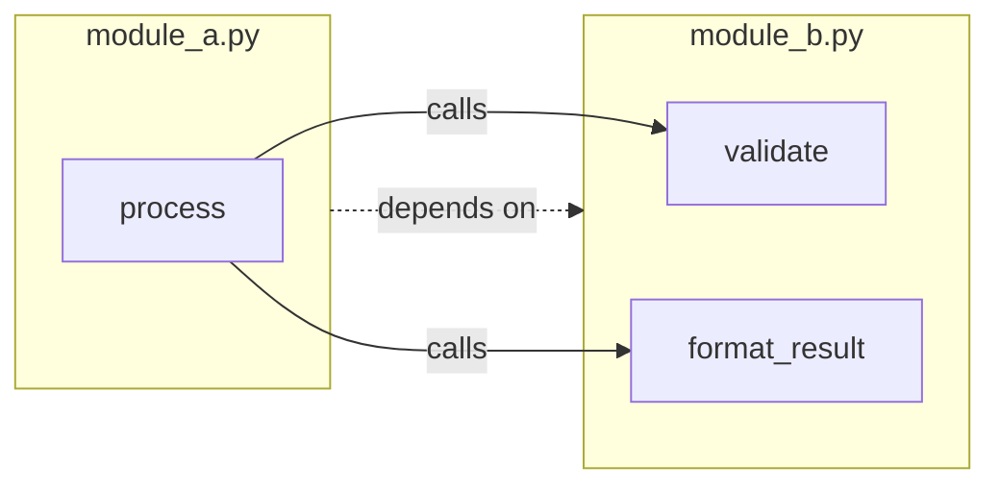
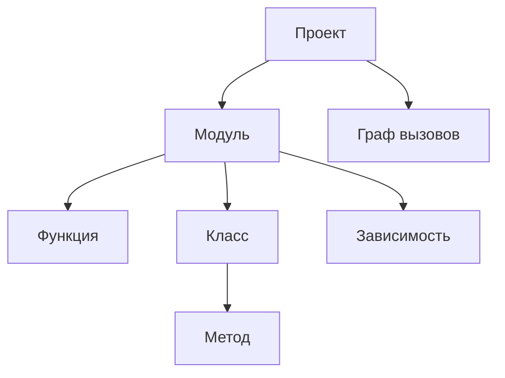
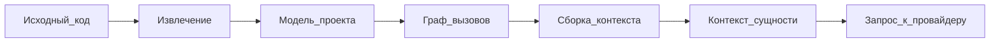

# Метод подготовки входных данных

Документ описывает метод извлечения информации из исходного кода, структуру данных для представления элементов программы, схему формирования входных данных для генерации документации и примеры подготовленных структур. Охватывает этапы от синтаксического разбора до сборки запроса к провайдеру генерации текста.

## 1. Метод извлечения информации из исходного кода

### 1.1. Общий подход

Алгоритм извлечения информации из исходного кода одинаков для всех поддерживаемых языков:

1. Прочитать текстовое содержимое исходного файла.
2. Выполнить синтаксический разбор и построить дерево (или граф) структуры программы.
3. Обойти дерево и извлечь программные сущности: модуль, зависимости, классы, функции, сигнатуры, документирующие комментарии, вызовы.
4. Для каждой функции и метода вычислить **цикломатическую сложность**; значение сохраняется для отчётов прогона.
5. Построить **граф вызовов** по всему проекту: связи «вызывающая сущность → вызываемая сущность» с учётом импортов и разрешения имён между модулями.
6. Построить **модель проекта** — единое структурированное представление всех модулей и графа зависимостей.

### 1.2. Средства синтаксического разбора

Предпочтительны **языко-специфичные парсеры**: они строят дерево разбора в формате, привязанном к конструкциям данного языка (модули, классы, сигнатуры, аннотации, импорты), и позволяют напрямую извлекать поля, перечисленные в п. 1.3. **Универсальные парсеры** (ANTLR, Tree-sitter и аналоги) в типичном случае дают обобщённое синтаксическое дерево или фрагменты текста без семантики языка; для получения той же богатой модели потребуется дополнительный обход и эвристики. Поэтому для основных языков системы используются специализированные средства; универсальные — для подключения новых языков, где готового парсера ещё нет.

| Язык | Версия | Рекомендуемые средства |
|------|--------|------------------------|
| Python | 3.10 | стандартный модуль `ast` |
| Java | 17 | **JavaParser** или **javalang** |
| Прочие языки | — | ANTLR, Tree-sitter — при отсутствии языко-специфичного парсера |

**Ограничение по версиям языка.** Поддерживаются синтаксические конструкции **включительно до указанной версии**: Python 3.10, Java 17. Конструкции, появившиеся в более поздних версиях (например, для Python — изменения синтаксиса в 3.11 и новее; для Java — языковые возможности Java 18 и новее), **не поддерживаются**: парсер может завершиться ошибкой, а соответствующие узлы не попадут в модель проекта.

Выбор конкретного парсера Java определяется на этапе реализации; оба варианта должны извлекать поля, перечисленные в п. 1.3, в пределах поддерживаемой версии языка.

### 1.3. Извлекаемые элементы

| Элемент | Извлекаемые поля |
|---------|------------------|
| Модуль | документирующий комментарий, зависимости, функции и классы верхнего уровня, мета-информация о пакете |
| Зависимость (import) | имя модуля, импортируемые имена, уровень вложенности |
| Класс | имя, базовые типы, модификаторы, аннотации, документирующий комментарий, поля, методы, позиция в файле |
| Функция / метод | имя, параметры, аннотации типов, тип возвращаемого значения, модификаторы, документирующий комментарий, исходящие рёбра графа вызовов, позиция в файле, полное тело |
| Вызов | вызывающая сущность, вызываемое имя (локальное или квалифицированное), целевой модуль при разрешении |
| Аннотации типов | строковое представление типов параметров и возвращаемого значения |
| Граф вызовов | узлы (функции и методы), рёбра (вызовы), зависимости между модулями |

### 1.4. Обработка docstrings и комментариев

Документирующие блоки (docstring, Javadoc, XML-комментарии и аналоги) извлекаются из соответствующих узлов дерева разбора.

### 1.5. Граф вызовов

При извлечении строится **граф вызовов** проекта.

**Узлы** — функции и методы с указанием модуля (и класса для методов). **Рёбра** — факт вызова: вызывающая сущность → вызываемая сущность. Для каждого вызова в теле функции фиксируется локальное имя; затем выполняется **разрешение имён** с учётом импортов, алиасов и относительных путей, чтобы связать вызов с конкретным узлом в другом модуле, если это возможно статически.

На основе графа вызовов формируются:

- **зависимости между модулями** — какие модули вызывают сущности из каких модулей;
- **порядок генерации документации** — сначала документируются «листовые» функции без исходящих зависимостей, затем их вызывающие (топологическая сортировка по графу);
- **контекст для генерации** — при документировании сущности включается уже сгенерированная (или существующая) документация вызываемых ею функций и методов.



**Граф вызовов между модулями.** Функция `process` в `module_a.py` вызывает `validate` и `format_result` из `module_b.py`; модуль A зависит от модуля B.

### 1.6. Граничные случаи

Ключевые языковые конструкции и их поддержка:

**Python**

| Конструкция | Статус |
|-------------|--------|
| Декораторы (`@decorator`) | частичная поддержка — декоратор извлекается как имя; семантика не анализируется |
| `@property`, `@staticmethod`, `@classmethod` | поддерживается — метод классифицируется по типу |
| `__init__.py`, re-exports | частичная поддержка — импорты извлекаются; re-export может не разрешаться |
| Динамические вызовы (`getattr`, `eval`, вызов через переменную) | не поддерживается — ребро вызова не создаётся |
| `*args`, `**kwargs` | частичная поддержка — параметры извлекаются; описание в документации может быть обобщённым |
| Синтаксическая ошибка в файле | поддерживается — файл пропускается, ошибка фиксируется в отчёте |

**Java**

| Конструкция | Статус |
|-------------|--------|
| Annotations (`@Override`, custom) | поддерживается — строковое представление на сущности |
| Generic типы | частичная поддержка — типы параметров из исходного текста; стирание времени выполнения не учитывается |
| Вызовы рефлексии | не поддерживается |
| Inner / nested classes | поддерживается — класс привязан к внешнему; методы извлекаются |
| Синтаксическая ошибка в файле | поддерживается — файл пропускается, ошибка в отчёте |

Неразрешённые вызовы в графе отражаются в контексте как локальное имя без ссылки на документацию зависимости.

## 2. Структура данных для представления элементов программы

Модель проекта — единое структурированное представление всех модулей и графа зависимостей, формируемое на этапе извлечения.

### 2.1. Иерархия модели проекта

- **Проект**
  - путь к корневому каталогу;
  - список модулей;
  - граф вызовов.
- **Модуль**
  - путь к исходному файлу;
  - документирующий комментарий модуля;
  - мета-информация о пакете;
  - список зависимостей (импорты, включения);
  - список функций;
  - список классов.
- **Зависимость**
  - импортируемый модуль, имена, уровень вложенности.
- **Функция**
  - имя, параметры, тип возвращаемого значения;
  - документирующий комментарий;
  - цикломатическая сложность;
  - полный текст тела;
  - исходящие рёбра графа вызовов;
  - позиция в исходном файле.
- **Класс**
  - имя, базовые типы, модификаторы, аннотации;
  - список полей;
  - список методов;
  - документирующий комментарий;
  - позиция в исходном файле.
- **Параметр**
  - имя, тип, значение по умолчанию.
- **Граф вызовов**
  - узлы (функции и методы), рёбра (вызовы), зависимости между модулями.



**Иерархия модели проекта.** Проект объединяет модули и граф вызовов; каждый модуль содержит функции, классы и зависимости; класс включает методы.

Поле вызовов у функции может хранить исходящие рёбра в компактном виде; полный граф собирается на уровне проекта отдельно.

### 2.2. JSON-пример модели проекта

Исходный код модуля `calculator/operations.py`:

```python
"""Arithmetic operations module."""

from typing import Optional

def add(a: float, b: float) -> float:
    return a + b
```

Модель проекта, полученная после извлечения:

```json
{
  "project_path": "/path/to/project",
  "modules": [
    {
      "path": "calculator/operations.py",
      "docstring": "Arithmetic operations module.",
      "imports": [
        {"module": "typing", "names": ["Optional"], "level": 0}
      ],
      "functions": [
        {
          "name": "add",
          "parameters": [
            {"name": "a", "type": "float", "default": null},
            {"name": "b", "type": "float", "default": null}
          ],
          "returns": "float",
          "docstring": null,
          "complexity": 1,
          "source_body": "return a + b",
          "calls": [],
          "line_start": 5,
          "line_end": 6
        }
      ],
      "classes": []
    }
  ],
  "call_graph": {
    "nodes": [
      {"id": "calculator/operations.py::add", "module": "calculator/operations.py", "name": "add", "kind": "function"}
    ],
    "edges": []
  }
}
```

## 3. Схема формирования входных данных для генерации

На основе модели проекта и дополнительного контекста проекта формируется контекст каждой сущности, из которого собирается запрос к провайдеру генерации.

### 3.1. Общая схема



**Схема формирования входных данных.** Исходный код преобразуется в модель проекта; граф вызовов определяет порядок сущностей; для каждой сущности из модели, документации вызываемых сущностей, фрагмента README и при необходимости предыдущего вывода собирается контекст сущности и запрос к провайдеру.

### 3.2. Контекст сущности

Данные, собираемые для одной программной сущности перед генерацией документации. В запрос сущности включается **только информация, связанная с этой сущностью**; метаданные сборки проекта (pyproject.toml, pom.xml) используются только при генерации сводного файла проекта.

| Поле | Обязательность | Описание |
|------|----------------|----------|
| `entity_type` | да | `module` / `class` / `function` / `method` |
| `entity_name` | да | имя сущности |
| `module_path` | да | путь к исходному файлу |
| `signature` | да | строковая сигнатура |
| `source_docstring` | нет | docstring / Javadoc из исходника |
| `source_body` | да | полное тело функции/метода/класса |
| `imports` | да | импорты модуля |
| `called_entities_docs` | нет | документация вызываемых сущностей (из графа вызовов, в топологическом порядке) |
| `base_class_docs` | нет | документация базовых классов (для методов) |
| `project_name` | да | из конфигурации |
| `readme_excerpt` | нет | фрагмент README (лимит символов из конфигурации) |
| `previous_output_doc` | нет | ранее сгенерированный блок документации сущности (при повторной генерации) |
| `output_language` | да | код ISO 639-1 (`ru` / `en`) |
| `complexity` | для function/method | цикломатическая сложность |

#### Пример контекста (функция с вызовами)

Исходный код модуля `app/service.py`:

```python
from app.utils import validate, format_result


def process(data: dict) -> Result:
    validated = validate(data)
    return format_result(validated)
```

Контекст сущности для функции `process`:

```json
{
  "entity_type": "function",
  "entity_name": "process",
  "module_path": "app/service.py",
  "signature": "def process(data: dict) -> Result",
  "source_docstring": null,
  "source_body": "validated = validate(data)\nreturn format_result(validated)",
  "imports": [{"module": "app.utils", "names": ["validate", "format_result"]}],
  "called_entities_docs": [
    {"name": "validate", "content": "### validate(data: dict) -> bool\n\n..."},
    {"name": "format_result", "content": "### format_result(data: dict) -> Result\n\n..."}
  ],
  "base_class_docs": [],
  "project_name": "my_app",
  "readme_excerpt": null,
  "previous_output_doc": null,
  "output_language": "ru",
  "complexity": 2
}
```

### 3.3. Сборка запроса к провайдеру

Один запрос к провайдеру соответствует одной сущности. Запрос состоит из **system** и **user** сообщений.

**System message** (шаблон, English) собирается из общей части, блока заголовков секций по `entity_type` и заключительных инструкций.

**Общая часть** (для любого `entity_type`):

```
You are a technical documentation generator.
Write section body text in {output_language}.
Respond with Markdown using exactly these English section headers (in this order), with no extra sections:
```

**Блок заголовков секций** — в system message подставляется **только один** из вариантов ниже, в зависимости от `entity_type` документируемой сущности:

`entity_type` = **`function`** или **`method`**:

```
## Summary
## Parameters
## Returns
## Raises
## Edge cases
## Side effects
## Examples
## See also
```

`entity_type` = **`class`**:

```
## Summary
## Fields
## Inheritance
## Methods overview
```

`entity_type` = **`module`**:

```
## Summary
## Exports
```

**Заключительная часть** (для любого `entity_type`):

```
Use "N/A" in a section when it does not apply. Do not invent parameters, types, or behavior not present in the source code.
```

**User message** — секции в порядке убывания приоритета при усечении:

| Секция | Содержание |
|--------|------------|
| Entity | тип, имя, сигнатура, цикломатическая сложность (если есть) |
| Source | docstring из исходника, полное тело |
| Previous output | ранее сгенерированная документация (если есть) |
| Dependencies | импорты модуля |
| Called entities | документация вызываемых функций/методов |
| Base classes | документация базовых классов |
| Project | название и описание проекта |

**Политика усечения:** при превышении лимита контекста провайдера секции усекаются в обратном порядке приоритета. Секции Entity и Source не усекаются.

**Не включается** в запрос сущности: содержимое pyproject.toml, pom.xml и аналогов (используется только для сводного файла проекта).

### 3.4. Формат ожидаемого ответа провайдера

Провайдер возвращает **Markdown-текст** с фиксированными **английскими заголовками секций**; текст внутри секций — на языке `output_language`. Набор заголовков зависит от `entity_type` документируемой сущности (как в п. 3.3).

`entity_type` = **`function`** или **`method`**

Заголовки секций (обязательный порядок):

```markdown
## Summary
## Parameters
## Returns
## Raises
## Edge cases
## Side effects
## Examples
## See also
```

Формат содержимого секций:

| Секция | Формат |
|--------|--------|
| Summary | связный текст |
| Parameters | маркированный список, каждый элемент: имя (`type`) — описание |
| Returns | одна строка: `type` — описание |
| Raises, Edge cases, Side effects, Examples, See also | маркированный список или строка `N/A` |

Пример секции Parameters:

```markdown
- `a` (`float`) — первое слагаемое
- `b` (`float`) — второе слагаемое
```

Пример секции Returns:

```markdown
- `float` — сумма a и b
```

`entity_type` = **`class`**

Заголовки секций (обязательный порядок):

```markdown
## Summary
## Fields
## Inheritance
## Methods overview
```

`entity_type` = **`module`**

Заголовки секций (обязательный порядок):

```markdown
## Summary
## Exports
```

## 4. Примеры структурированных входных данных

### 4.1. Пример (Python)

#### 4.1.1. Исходный код

```python
"""Simple calculator module."""

def add(a: float, b: float) -> float:
    return a + b


class Calculator:
    """Performs basic arithmetic."""

    def multiply(self, x: int, y: int) -> int:
        return x * y
```

#### 4.1.2. Фрагмент модели проекта

```json
{
  "path": "calculator.py",
  "docstring": "Simple calculator module.",
  "functions": [
    {
      "name": "add",
      "parameters": [{"name": "a", "type": "float"}, {"name": "b", "type": "float"}],
      "returns": "float",
      "complexity": 1,
      "source_body": "return a + b"
    }
  ],
  "classes": [
    {
      "name": "Calculator",
      "docstring": "Performs basic arithmetic.",
      "methods": [
        {
          "name": "multiply",
          "parameters": [{"name": "self"}, {"name": "x", "type": "int"}, {"name": "y", "type": "int"}],
          "returns": "int",
          "complexity": 1
        }
      ]
    }
  ]
}
```

#### 4.1.3. Фрагмент графа вызовов

```json
{
  "nodes": [
    {"id": "calculator.py::add", "module": "calculator.py", "name": "add", "kind": "function"},
    {"id": "calculator.py::Calculator.multiply", "module": "calculator.py", "name": "multiply", "kind": "method", "class": "Calculator"}
  ],
  "edges": []
}
```

#### 4.1.4. Контекст сущности для функции `add`

```json
{
  "entity_type": "function",
  "entity_name": "add",
  "module_path": "calculator.py",
  "signature": "def add(a: float, b: float) -> float",
  "source_docstring": null,
  "source_body": "return a + b",
  "imports": [],
  "called_entities_docs": [],
  "base_class_docs": [],
  "project_name": "calculator_app",
  "readme_excerpt": null,
  "previous_output_doc": null,
  "output_language": "ru",
  "complexity": 1
}
```

### 4.2. Пример (Java)

#### 4.2.1. Исходный код

```java
package com.example.calc;

/**
 * Simple calculator utility.
 */
public class Calculator {

    /**
     * Adds two numbers.
     */
    public static double add(double a, double b) {
        return a + b;
    }
}
```

#### 4.2.2. Фрагмент модели проекта

```json
{
  "path": "com/example/calc/Calculator.java",
  "package": "com.example.calc",
  "docstring": "Simple calculator utility.",
  "imports": [],
  "functions": [],
  "classes": [
    {
      "name": "Calculator",
      "modifiers": ["public"],
      "docstring": null,
      "methods": [
        {
          "name": "add",
          "modifiers": ["public", "static"],
          "parameters": [
            {"name": "a", "type": "double"},
            {"name": "b", "type": "double"}
          ],
          "returns": "double",
          "docstring": "Adds two numbers.",
          "complexity": 1,
          "source_body": "return a + b;"
        }
      ]
    }
  ]
}
```

#### 4.2.3. Контекст сущности для метода `add`

```json
{
  "entity_type": "method",
  "entity_name": "add",
  "module_path": "com/example/calc/Calculator.java",
  "signature": "public static double add(double a, double b)",
  "source_docstring": "Adds two numbers.",
  "source_body": "return a + b;",
  "imports": [],
  "called_entities_docs": [],
  "base_class_docs": [],
  "project_name": "calculator_app",
  "readme_excerpt": null,
  "previous_output_doc": null,
  "output_language": "en",
  "complexity": 1
}
```
